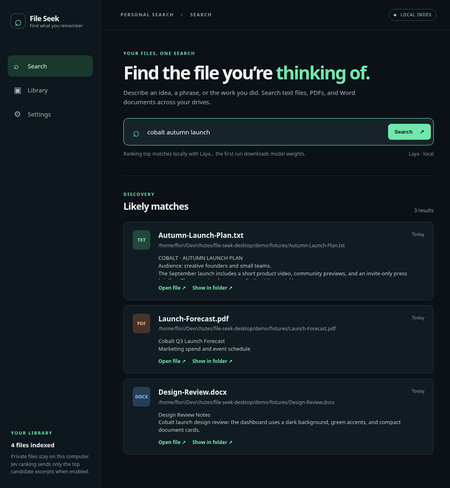

**Point your local coding agent at this repository and ask it to install File Seek, create a desktop shortcut, and open the app; follow the [agent installation guide](#agent-installation-guide).**

# File Seek

Search your own text files, PDFs, and Word documents with a fast local index and a Jev-class ranking model. Describe the file you remember; File Seek lists likely matches, their paths and dates, and opens the originals in your default app.



[Watch the launch video](media/launch.mp4) · [Download installers](https://github.com/fstandhartinger/file-seek-desktop/releases)

## Start here

1. Open **Library**. Add a folder, or press **Add every drive** to cover the machine's detected volumes. Press **Scan now**. An initial full-disk scan may take a long time; later scans skip unchanged files.
2. Open **Search** and describe the document. Keyword matches appear first; the top 12 candidates are then reranked with **Laya** on your computer. First Laya use downloads about 1.7 GB of model weights.
3. Click **Open file** or **Show in folder** on a result.
4. Optional: open **Settings**, get a TypeSafe key using the **TypeSafe Console** button, paste it into the masked field, then select **Jev**. The app asks for consent before switching to remote ranking.

No API key is needed for indexing, keyword search, or local Laya ranking. The extracted index stays in the app's local data directory. Jev sends the query, file paths, and up to 12 short candidate excerpts to TypeSafe; API charges and provider data policies may apply. Keys are encrypted with the operating system's key storage when Electron reports it available; otherwise pasted keys last only for the running session. `TYPESAFE_API_KEY` is also supported.

## Installers

Tagged builds run on GitHub Actions for **Windows (NSIS .exe)**, **macOS (.dmg)**, and **Linux (.AppImage and .deb)**. Download the artifact matching your computer from [Releases](https://github.com/fstandhartinger/file-seek-desktop/releases) or the tagged build's Actions artifacts. The Windows installer creates a desktop shortcut. On macOS move the app to Applications and use Finder's Make Alias if a desktop icon is wanted. On Linux install the .deb and create a desktop launcher, or mark the AppImage executable and make a shortcut to it. macOS and Windows binaries from this independent project may require local trust approval because they are unsigned.

## Agent installation guide

For Claude Code, Codex, ChatGPT Work, Claude Cowork, or another agent with **local terminal and desktop access**:

1. Detect the real user's OS, CPU architecture, account, desktop environment, and whether you are running locally, in WSL, over SSH, or in a cloud workspace. A remote or cloud agent cannot install a desktop icon on the user's laptop without a local execution path; tell the user what local handoff is needed.
2. Clone this repository. Prefer a matching tagged installer when available. Verify download source, install it, and launch File Seek. If a platform build has not completed, build from source on that platform using the commands below. Do not copy a Linux binary to Windows or macOS.
3. Create a desktop shortcut with the OS's normal mechanism and open the app. On Windows the NSIS installer does this automatically. On macOS create an alias to the installed app; on Linux create a `.desktop` entry pointing at the installed executable or AppImage. Verify the shortcut launches the app.
4. Ask the user which disks or folders to include if they have not already specified them. The **Add every drive** button covers detected volumes; run the first scan and verify a known TXT/PDF/DOCX file can be found. Explain inaccessible files, encrypted volumes, cloud placeholders, and size limits accurately.
5. Explain that local search and Laya need no key. Offer Jev only if the user wants remote ranking. Show **Settings → TypeSafe Console → paste API key → select Jev**. Explain exactly which excerpts and paths are sent. Do not paste keys into chat, commit them, or store them in plaintext settings.
6. Tell the user how to launch the desktop app and search: open **File Seek** from the desktop icon, choose **Library** to scan, then type a description in **Search**. State whether the live installation was tested, whether local Laya loaded, and whether Jev was actually called.

To build from source on the target computer, install Node.js 22+ and Python 3.11+:

```sh
npm ci
python -m venv .venv
# activate the venv using your OS shell, then:
python -m pip install -r requirements.txt
python -m PyInstaller --onefile --name indexer --distpath backend/dist backend/indexer.py
npm run build
```

`npm start` runs the unbundled development app. `npm test` runs the JS and Python tests when the Python dependencies are installed. Package names, shortcut paths, and trust dialogs differ by OS; adapt these commands locally.

## How it works

The Python sidecar walks chosen locations without following directory symlinks, extracts text, and stores it in SQLite FTS5 in the app data folder. Files whose size and modification time have not changed are reused. Search gets a small lexical shortlist and shows it immediately. Laya (local ONNX on CPU) or Jev (optional TypeSafe API) scores the top 12 files. The app never reads files into an external service for basic search.

Supported text extensions include TXT, Markdown, CSV, JSON, logs, common source code and config formats, plus PDF and DOCX. This version does **not** perform OCR on scanned PDFs or images. Files above 40 MB are skipped; extraction is capped at 2 million characters per file. Locked files and folders the current account cannot read are skipped and counted as errors. Linux virtual system trees such as `/proc`, `/sys`, and `/dev` are skipped. A full-disk scan can be slow and use substantial index space. Query terms must overlap indexed text or filenames to reach the semantic shortlist.

## Development and verification

Run `npm test`, launch the desktop window with `npm start`, and verify indexing/search/opening in the target OS. The launch video uses illustrative documents and screenshots. CI builds installers on each OS, but each installer still needs an interactive smoke test on that OS before claiming full platform validation. The app has no telemetry.

MIT licensed. Laya weights are downloaded separately under Apache 2.0.
